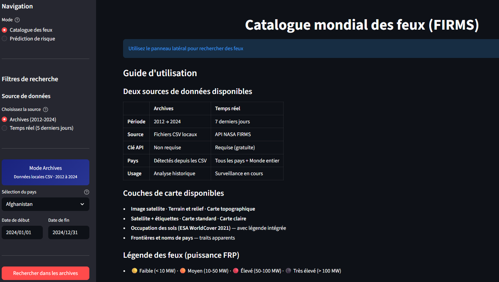
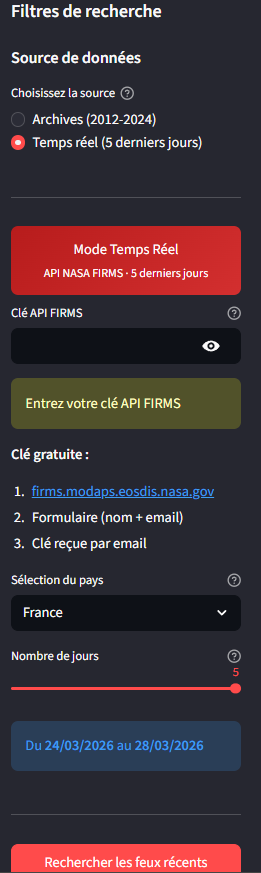
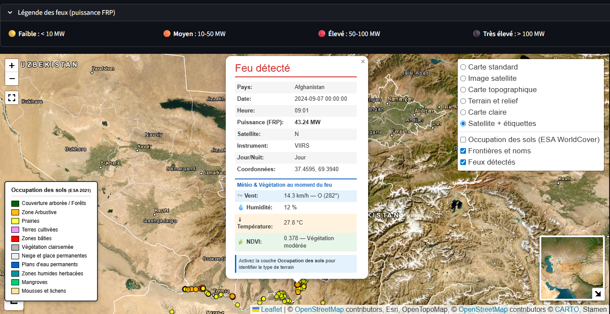
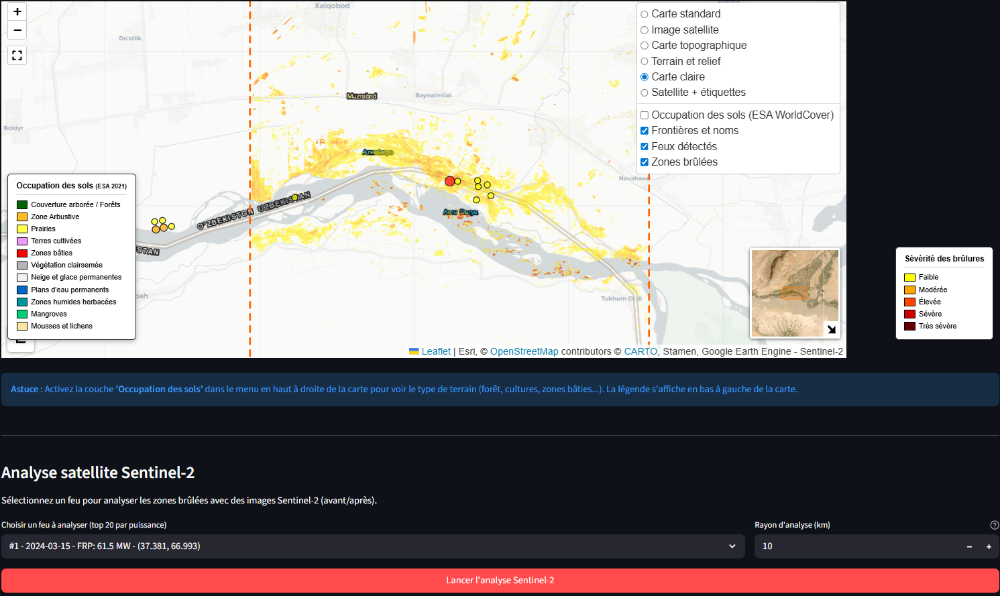
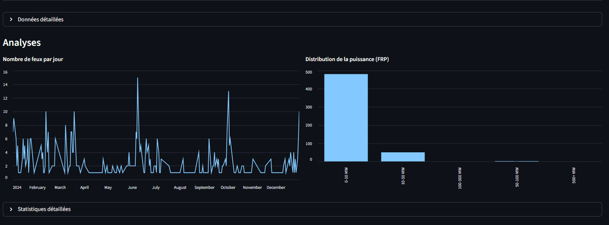
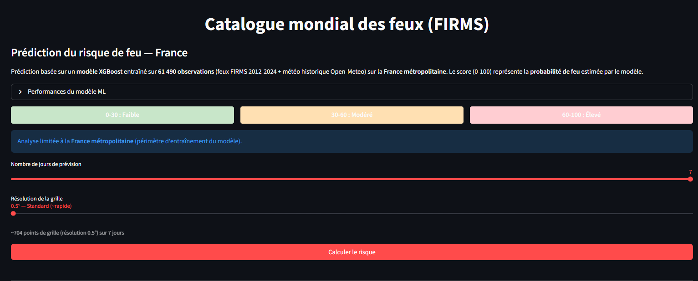
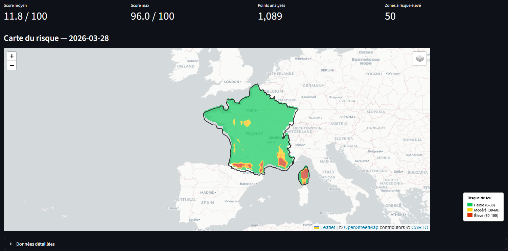

# FIRMS Télédéctection feu & Prédiction de risque


[!WARNING]
Les temps de chargement (meteo, analyse satellite, prediction) peuvent varier en fonction des performances de votre machine et de votre connexion internet.

Projet de geomatique centre sur la surveillance des feux a l'echelle mondiale et la prediction du risque d'incendie sur la France metropolitaine.

L'application combine plusieurs sources de donnees ouvertes (NASA FIRMS, Sentinel-2, Open-Meteo, ESA WorldCover) pour offrir a la fois un catalogue interactif des feux detectes et un outil de prediction du risque base sur un modele de machine learning.

---

## Pourquoi ce projet ?

Les feux  representent un enjeu environnemental majeur. Les donnees satellites permettent aujourd'hui de detecter les incendies en quasi temps reel, mais elles sont dispersees sur plusieurs plateformes et difficiles a croiser entre elles.

Ce projet centralise ces donnees dans une interface unique et y ajoute une couche d'analyse : enrichissement meteorologique, imagerie satellite avant/apres incendie, et prediction du risque a 7 jours.

---

## Ce que fait l'application

### 1. Catalogue des feux



Deux modes de consultation :

- Archives (2012-2024) : donnees FIRMS stockees en CSV, pas besoin de connexion API. On selectionne un pays et une periode, l'application affiche les feux sur une carte interactive.
- Temps reel (5 derniers jours) : interrogation directe de l'API NASA FIRMS. Necessite une cle API gratuite (obtenue en 2 minutes sur le site de la NASA).



Pour chaque feu, on retrouve dans les popups : la date et l'heure de detection, la puissance radiative (FRP en MW), le satellite et l'instrument utilises, et si c'etait de jour ou de nuit.



#### Enrichissement des donnees

Une fois les feux charges, on peut les enrichir avec :

- Meteo au moment du feu : vitesse et direction du vent, humidite, temperature. Les donnees viennent de l'API Open-Meteo (reanalyse ERA5). Les requetes sont groupees par cellules de 1 degre pour limiter les appels.
- NDVI (indice de vegetation) : calcule via Google Earth Engine a partir des images MODIS 250m. Permet de savoir si le feu a touche une zone de vegetation dense ou clairsemee.

#### Analyse Sentinel-2

Pour les feux les plus puissants, on peut lancer une analyse satellite Sentinel-2. L'application recupere via Google Earth Engine une image avant et une image apres l'incendie, calcule le dNBR (difference de Normalized Burn Ratio), et affiche sur la carte les zones brulees classees par severite. Les statistiques (surface totale analysee, surface brulee, surface severement brulee en hectares) sont aussi affichees.



#### Analyses et statistiques



#### Couches de carte

La carte Folium propose plusieurs fonds :
- OpenStreetMap, satellite Esri, topographie, terrain, carte claire
- Occupation des sols ESA WorldCover 2021 (forets, cultures, zones baties, etc.) avec sa legende
- Frontieres et noms de pays
- Mini-carte de localisation, outil de mesure de distance, plein ecran

### 2. Prediction du risque (France metropolitaine)

Le modele de prediction est limite a la France parce que c'est sur ces donnees qu'il a ete entraine. On ne voulait pas afficher des predictions sur des zones ou le modele n'a jamais vu de donnees — ca aurait donne des resultats peu fiables.



#### Comment ca marche

1. On genere une grille de points sur la France (resolution configurable : 0.5 ou 0.25 degre)
2. Pour chaque point, on recupere les previsions meteo a 7 jours via Open-Meteo (temperature max, humidite min, vent max, precipitations)
3. Ces donnees passent dans le modele XGBoost qui retourne une probabilite de feu
4. La probabilite est convertie en score 0-100 et affichee sur une carte interpolee



#### Le modele XGBoost

Le modele a ete entraine sur un dataset de 61 490 observations construit comme suit :

- Exemples positifs : points ou un feu a reellement ete detecte par FIRMS entre 2012 et 2024
- Exemples negatifs : points aleatoires dans les memes zones et periodes, mais sans feu detecte
- Pour chaque point : on a recupere la meteo historique (Open-Meteo Archive API)

Les 10 données utilisees :
| Donnée | Description |
|---------|-------------|
| `latitude`, `longitude` | Position geographique |
| `temp_max` | Temperature maximale du jour (°C) |
| `humidity_min` | Humidite minimale du jour (%) |
| `wind_max` | Vitesse maximale du vent (km/h) |
| `precip_sum` | Precipitations cumulees (mm) |
| `month` | Mois de l'annee |
| `day_of_year` | Jour de l'annee (1-365) |
| `month_sin`, `month_cos` | Encodage cyclique du mois |

Performances sur le jeu de test : AUC-ROC ~0.97, accuracy ~93%. Les metriques completes (matrice de confusion, importance des features, cross-validation) sont visibles directement dans l'application.

#### Seuils de risque

| Score | Niveau | Couleur sur la carte |
|-------|--------|---------------------|
| 0 - 30 | Faible | Vert |
| 30 - 60 | Modere | Jaune / Orange |
| 60 - 100 | Eleve | Rouge |

---

## Architecture du projet

```
project_geodata/
├── app_improved.py                  # Application Streamlit (interface complete)
├── config.yaml                      # Configuration generale
├── requirements.txt                 # Dependances Python
│
├── data_sources/
│   ├── fires/
│   │   ├── firms.py                 # Chargement des archives CSV (180+ pays)
│   │   ├── firms_api.py             # Client API NASA FIRMS (temps reel)
│   │   └── historical/              # Fichiers CSV par pays (2012-2024)
│   ├── satellite/
│   │   └── sentinel2.py             # Analyse Sentinel-2 via Google Earth Engine
│   └── weather/
│       └── meteo.py                 # Meteo Open-Meteo (ERA5 historique + previsions)
│
├── processing/
│   ├── fire_risk.py                 # Prediction XGBoost + generation carte interpolee
│   ├── geometry.py                  # Geocoding et parsing de coordonnees
│   ├── time.py                      # Parsing de dates
│   └── user_request.py              # Validation des requetes utilisateur
│
└── ml/
    ├── build_dataset.py             # Pipeline de construction du dataset
    ├── train_model.py               # Entrainement et evaluation XGBoost
    ├── datasets/                    # Datasets generes (gitignore)
    └── models/                      # Modeles sauvegardes (gitignore)
```

---

## Installation

### Prerequis

- Python 3.10 ou superieur
- Un compte Google Earth Engine (pour l'analyse Sentinel-2 et le NDVI)
- Une cle API NASA FIRMS (pour le mode temps reel uniquement) — gratuite sur [firms.modaps.eosdis.nasa.gov](https://firms.modaps.eosdis.nasa.gov/api/area/)

### Mise en place

```bash
git clone <url-du-repo>
cd project_geodata

python -m venv venv
source venv/bin/activate        # Linux / Mac
# venv\Scripts\activate         # Windows

pip install -r requirements.txt
```

### Donnees historiques FIRMS (archives CSV)

Les fichiers CSV d'archives (2012-2024) ne sont pas inclus dans le repo car ils pesent ~20 Go. Pour utiliser le mode Archives de l'application, il faut les telecharger depuis le site NASA FIRMS :

1. Aller sur [https://firms.modaps.eosdis.nasa.gov/download/](https://firms.modaps.eosdis.nasa.gov/download/)
2. Telecharger les archives VIIRS-SNPP par pays et par annee
3. Placer les CSV dans `data_sources/fires/historical/<annee>/` en respectant le format `viirs-snpp_<annee>_<pays>.csv`

> [!NOTE]
> Le mode Temps reel (API) fonctionne sans ces fichiers. Seul le mode Archives en a besoin.

### Entrainer le modele de prediction

Le modele n'est pas inclus dans le repo (bonne pratique : on ne versionne pas les binaires). Pour l'entrainer :

```bash
# 1. Construire le dataset (feux FIRMS + meteo historique)
python -m ml.build_dataset

# 2. Entrainer le XGBoost
python -m ml.train_model
```

Le dataset est construit a partir des CSV FIRMS presents dans `data_sources/fires/historical/` et des donnees meteo recuperees via l'API Open-Meteo Archive. L'entrainement prend quelques minutes.

Options disponibles :
```bash
# Specifier les pays et annees
python -m ml.build_dataset --countries France --years 2020 2021 2022 --samples 10000

# Specifier un dataset particulier
python -m ml.train_model --dataset ml/datasets/mon_dataset.csv
```

---

## Lancer l'application

```bash
streamlit run app_improved.py
```

L'application s'ouvre dans le navigateur sur `http://localhost:8501`.

- Le catalogue des feux fonctionne directement avec les archives CSV, sans configuration.
- Le mode temps reel demande une cle API FIRMS (saisie dans l'interface).
- La prediction du risque necessite que le modele ait ete entraine au prealable.
- L'analyse Sentinel-2 et le NDVI necessitent une authentification Google Earth Engine.

---

## Sources de donnees

| Source | Ce qu'on en tire | Acces |
|--------|-----------------|-------|
| [NASA FIRMS](https://firms.modaps.eosdis.nasa.gov/) | Detections de feux actifs (capteurs VIIRS et MODIS) | API gratuite, cle requise |
| [Open-Meteo](https://open-meteo.com/) | Meteo historique ERA5 + previsions a 7 jours | API gratuite, sans cle |
| [Google Earth Engine](https://earthengine.google.com/) | Imagerie Sentinel-2 (zones brulees) + NDVI MODIS | Compte GEE gratuit |
| [ESA WorldCover](https://esa-worldcover.org/) | Carte d'occupation des sols 2021 (10m) | WMS en libre acces |
| [Nominatim / OpenStreetMap](https://nominatim.openstreetmap.org/) | Geocoding + contours des pays | API libre |

---

## Stack technique

| Composant | Role |
|-----------|------|
| Streamlit | Interface web |
| Folium | Cartes interactives |
| Pandas / NumPy | Manipulation de donnees |
| XGBoost | Modele de prediction |
| scikit-learn| Evaluation et preprocessing |
| SciPy | Interpolation spatiale |
| Shapely | Operations geometriques |
| Google Earth Engine API | Acces aux images satellites |
| Requests | Appels API (FIRMS, Open-Meteo, Nominatim) |
